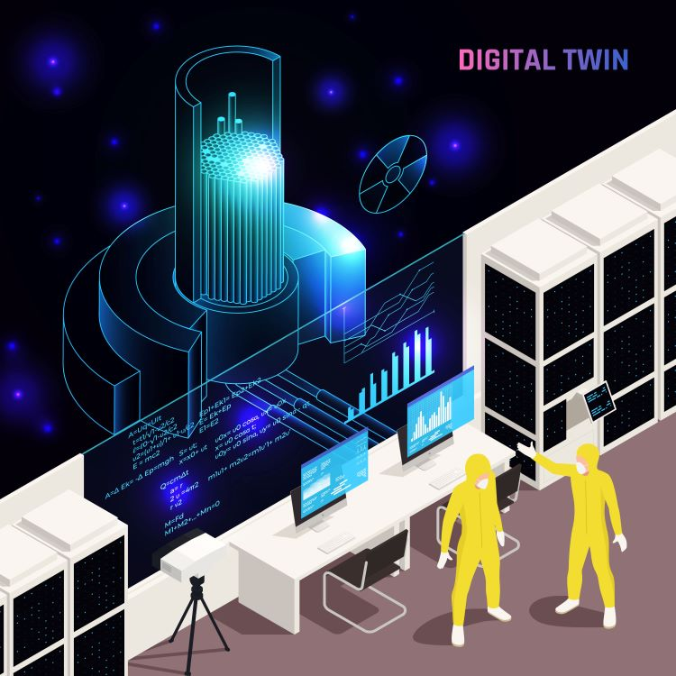
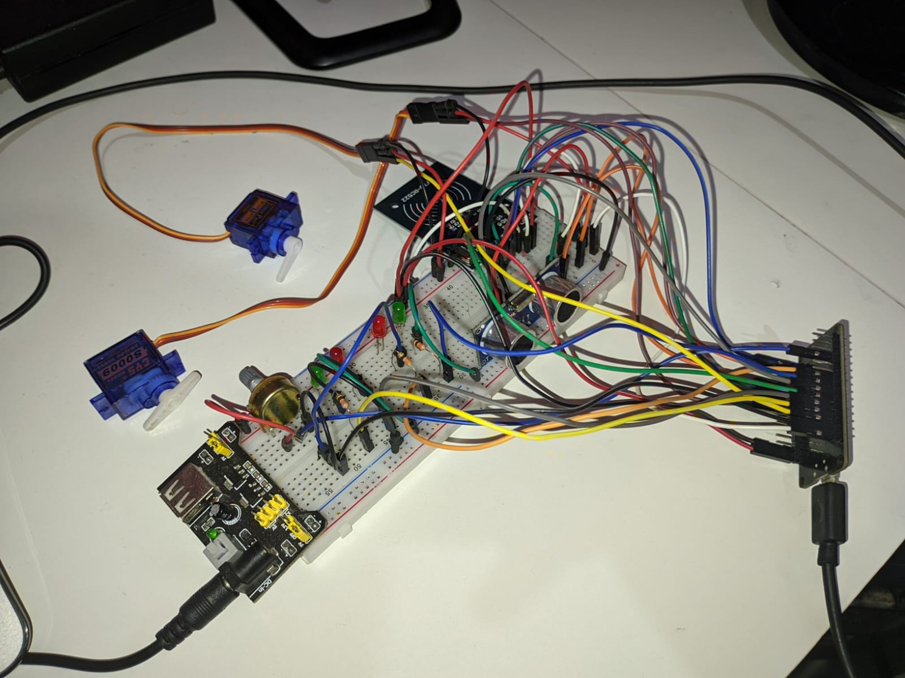

# Challenge Toledo (2023)

## Descrição do Projeto

O projeto desenvolvido para o Challenge Toledo busca criar um gêmeo digital de um ambiente de pesagem industrial. O objetivo é simular com precisão as operações de pesagem em um ambiente virtual construído na Unreal Engine 5, sincronizando-o com um protótipo físico construído com Arduino. A conexão entre esses dois ambientes é estabelecida através da porta serial utilizando o plugin [Serial COM](https://github.com/videofeedback/Unreal_Engine_SerialCOM_Plugin).

O gêmeo digital permite que operadores e engenheiros realizem testes, otimizem processos, e aprimorem a eficiência do ambiente de pesagem industrial, tudo sem a necessidade de interagir diretamente com o sistema físico, economizando tempo e recursos.

## Funcionalidades Principais

O projeto possui as seguintes funcionalidades principais:

- **Gêmeo Digital**: Um ambiente virtual detalhado é construído na Unreal Engine 5, representando o ambiente de pesagem industrial. Ele é uma réplica fiel do sistema físico e permite a interação e simulação com diversos componentes, como sensores, atuadores e dispositivos de controle.

- **Protótipo Físico com Arduino**: Um protótipo físico é desenvolvido utilizando a plataforma Arduino. Esse protótipo é equipado com sensores e outros dispositivos relevantes para simular o processo de pesagem no ambiente industrial.

- **Conexão Serial**: A comunicação entre o ambiente virtual e o protótipo físico é estabelecida através da porta serial, utilizando o plugin Serial COM. Dados de sensores e comandos de controle são trocados em tempo real entre os dois sistemas.

- **Visualização em Tempo Real**: As informações coletadas pelo protótipo físico são transmitidas para o ambiente virtual, permitindo a visualização em tempo real de dados como pesos medidos, status de dispositivos e outras informações relevantes.

<!-- - **Controle Remoto**: O ambiente virtual possibilita o controle remoto de atuadores no protótipo físico. Isso permite que os usuários testem diferentes cenários e modifiquem o comportamento do sistema físico de forma segura. -->

<!-- - **Análise e Otimização**: Recursos de análise e otimização para o ambiente de pesagem industrial. Os usuários podem coletar dados, identificar padrões, realizar simulações e ajustar parâmetros para melhorar a eficiência e a precisão do processo de pesagem. -->

## Arquivos do Projeto

O projeto é composto por vários arquivos que são fundamentais para a sua execução e compreensão. Abaixo estão os principais arquivos do projeto:

- **ChallengeToledo.ino**: Este arquivo contém o código-fonte da programação do Arduino. Ele é responsável por controlar os dispositivos físicos, ler os sensores e estabelecer a comunicação com o ambiente virtual por meio da porta serial. O código implementado nesse arquivo é essencial para o funcionamento adequado do protótipo físico e sua sincronização com o ambiente virtual na Unreal Engine 5.

- **EletronicaChallenge.xlsx**: Esse arquivo é uma planilha eletrônica que descreve detalhadamente as conexões elétricas do protótipo físico desenvolvido com o Arduino. Ele mapeia a ligação dos sensores, atuadores e outros componentes eletrônicos ao Arduino, garantindo que a implementação física corresponda ao que é esperado pelo ambiente virtual. É uma referência importante para quem deseja montar o protótipo e entender a interconexão dos dispositivos.

- **Ambiente Virtual na Unreal Engine**: O ambiente virtual da Unreal Engine é o coração do projeto. O arquivo fornecido no link [aqui](https://drive.google.com/file/d/1ex6n0P7Qj17MwhivxlYXxKxVmsdrqS4h/view?usp=sharing) é o projeto da Unreal Engine 5 que representa o ambiente de pesagem industrial em formato virtual. Ele contém todos os ativos, texturas, blueprints e configurações necessárias para criar o gêmeo digital. Os usuários podem abrir esse arquivo na Unreal Engine para visualizar, interagir e simular o ambiente de pesagem industrial.

## Instruções de Uso

Para utilizar, siga os passos abaixo:

1. **Preparação do Ambiente Físico**:

   - Montar o protótipo físico utilizando a plataforma Arduino e os sensores necessários para a simulação de pesagem industrial.
   - Conectar os dispositivos físicos ao Arduino, garantindo que todos os componentes estejam funcionando corretamente.
   

2. **Preparação do Ambiente Virtual**:

   - Instalar a Unreal Engine 5 em seu computador.
   - Baixar os arquivos do Google Drive e importá-los para o projeto na Unreal Engine.
   - Configurar o ambiente virtual para refletir fielmente o ambiente de pesagem industrial físico.

3. **Conexão Serial**:

   - Verificar a disponibilidade da porta serial no computador e garantir que o Arduino esteja conectado corretamente.
   - No ambiente virtual, configurar o plugin Serial COM para estabelecer a conexão serial com o Arduino.

4. **Execução do Gêmeo Digital**:

   - Iniciar a simulação no ambiente virtual.
   - Acompanhar os dados transmitidos pelo protótipo físico no ambiente virtual, incluindo pesos medidos e informações de dispositivos.

<!-- 5. **Controle Remoto e Análise**:

   - Utilizar os controles do ambiente virtual para enviar comandos ao protótipo físico e verificar como ele responde.
   - Coletar dados, realizar análises e simulações para otimizar o processo de pesagem industrial. -->

### Instruções para abrir o projeto na Unreal Engine

1. Baixe o arquivo do ambiente virtual da Unreal Engine através do link fornecido.
   
2. Abra a Unreal Engine 5 no seu computador.
   
3. No menu da Unreal Engine, clique em "File" (Arquivo) e selecione "Open Project" (Abrir Projeto).
   
4. Navegue até o local onde salvou o arquivo do ambiente virtual e selecione-o para abri-lo na Unreal Engine.

5. Aguarde a Unreal Engine carregar o projeto. Uma vez carregado, você pode explorar e interagir com o gêmeo digital do ambiente de pesagem industrial.

Lembrando que o ambiente virtual na Unreal Engine e o protótipo físico no Arduino são partes integrantes do projeto. Ambos trabalham em conjunto, permitindo a simulação, teste e otimização do ambiente de pesagem industrial de forma mais segura e eficiente.

## Colaboradores

O projeto foi desenvolvido por um grupo de alunos do 4º ano do curso de Engenharia da Computação da FIAP. Os membros do grupo são:

| Turma | Nome                            | RM     |
|-------|---------------------------------|--------|
| 4ECR  | Carlos Henrique Neves Júnior    | 82378  |
| 4ECR  | Felipe Gabriel Correa da Silva | 85487  |
| 4ECR  | Guilherme Rosa Campanha         | 84162  |
| 4ECR  | Isabela Brito Pessoa           | 85912  |
| 4ECA  | Leandro de Jesus Luna          | 86492  |
| 4ECR  | Marcos Moura dos Santos        | 86507  |

## Contato

Se você tiver alguma dúvida, sugestão ou desejar mais informações sobre o projeto, sinta-se à vontade para entrar em contato conosco:

E-mail: leandro.j.luna@gmail.com

## Agradecimentos

Gostaríamos de agradecer a empresa Toledo do Brasil - PRIX pela oportunidade de participar do Challenge Toledo junto a FIAP. Foi uma experiência incrível e aprendemos muito com o projeto. Também gostaríamos de agradecer aos professores e mentores que nos ajudaram ao longo do desafio. Muito obrigado!